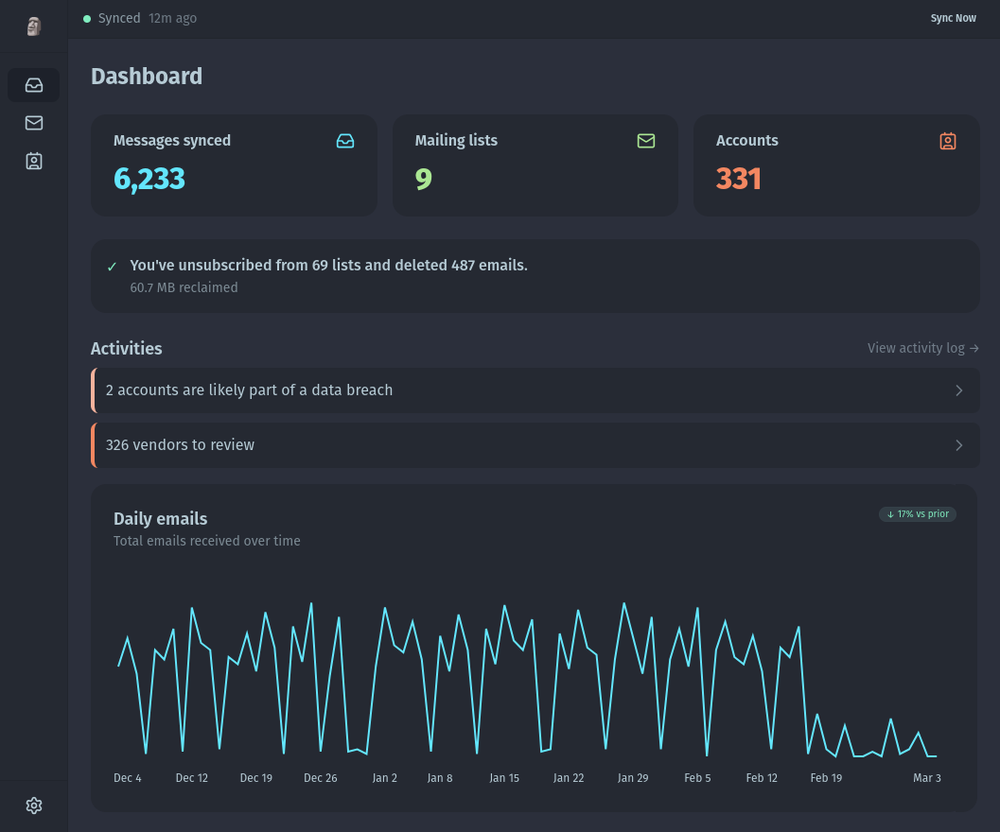

# Paperweight 🗿

**Your inbox knows where your data lives. We help you take back control.**

Every account you create, every service you sign up for, every online purchase is connected to your email address. Most people have 100+ accounts they've forgotten about, creating security risks and privacy exposure.

Paperweight scans your inbox to map your digital footprint, then helps you take back control and delete your data.

Local-first. Your data stays on your computer. Respecting your privacy by default.

## Features

- **Marketing/Bulk unsubscribe** — Find an unsubscribe from marketing and bulk mailing lists in minutes
- **Account inventory** — Discover which vendors and services have your data
- **Breach alerts** — Know when companies you use get breached (via haveibeenpwned.com)
- **GDPR deletion support** — Generate data deletion requests to reduce exposure
- **Local-first** — Your emails and settings stay on your machine
- **Privacy-respecting** — No data sent to external servers
- **Open development** — Built in public, source code available for audit

## Email Providers

- ✅ Custom IMAP
- ✅ Google / Gmail
- ✅ Microsoft
- 🔜 Apple (coming soon)

## Quick Start

1. Download [latest release](https://github.com/wslyvh/paperweight/releases) for your platform
2. Connect your email (Gmail, Outlook, or IMAP)
3. Scan your inbox in ~2 minutes
4. Start unsubscribing and deleting

## License

All features available in free tier. Upgrade for unlimited email history.

- **Free tier**: 30-day email scan, all features included
- **Early supporters license**: All features, unlimited email history, lifetime updates.

[Buy a lifetime license and support development →](https://www.paperweight.email/#pricing)

## Contributing

Feedback, bug reports, and PRs are welcome.
